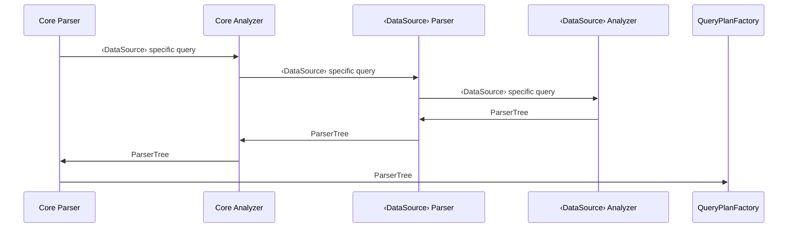
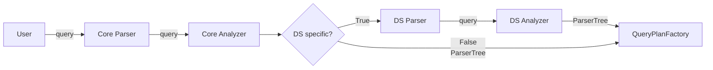
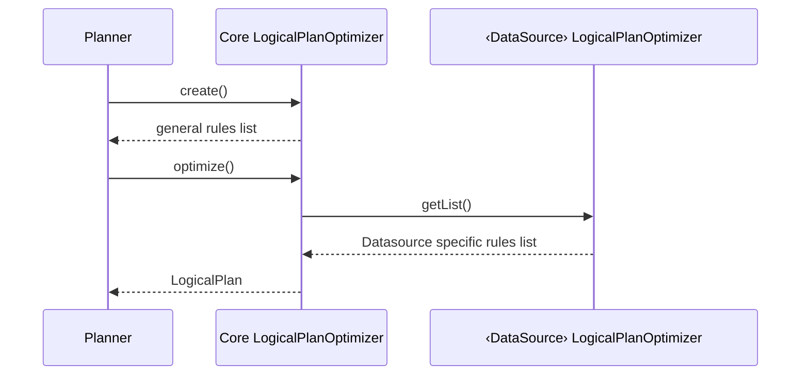

# 1. Overview

Improve extensibility of the SQL plugin, OpenSearch functions need to be moved from `core` module and moved to the `opensearch` module. This will prevent other data sources from being able to parse queries with OpenSearch specific functions like `MATCH_QUERY`.

# 2. Requirements

Resolve https://github.com/opensearch-project/sql/issues/811

## 2.1 Use case

1. Using SQL or PPL with OpenSearch data source. Users should be able to use all available functions that is supported by SQL, PPL, and OpenSearch.
2. Using SQL or PPL with data sources other than OpenSearch (Prometheus, for example). Users should be able to use implemented SQL and PPL functions.

## 2.2 Functional change

- Using data sources other than OpenSearch, users will encounter a `SyntaxCheckException` when they query with OpenSearch specific functions. (Some of these functions can be found in https://opensearch.org/docs/latest/search-plugins/sql/sql/functions/)
- The Parser will have a different token to categorize OpenSearch functions.
- Core module will no longer contain OpenSearch functions.

# 3. Design

## 3.1 Datasource specific parser

Core will maintain its parser, however OpenSearch functions will be under a new token called `userDefinedFunctions`. This new token will encompass datasource specific functions. Each datasource module will have its own parser which will be called once the core module analyzer visits this `userDefinedFunction` node in the generated parse tree. Then, the datasource module will parse this function and with its own analyzer, add these function nodes to the parse tree.

If the function for the above is `MATCH_QUERY`, OpenSearch will be the DataSource.

## 3.2 Datasource specific LogicalPlanOptimizer

 Rules in core LogicalPlanOptimizer should not include Datasource specific push down rules. For example, PUSH_DOWN_NESTED will be removed from the core LogicalPlanOptimizer. When optimizing a list of rules will be requested from the datasource module (This list can be empty. Prometheus would return an empty list currently).

