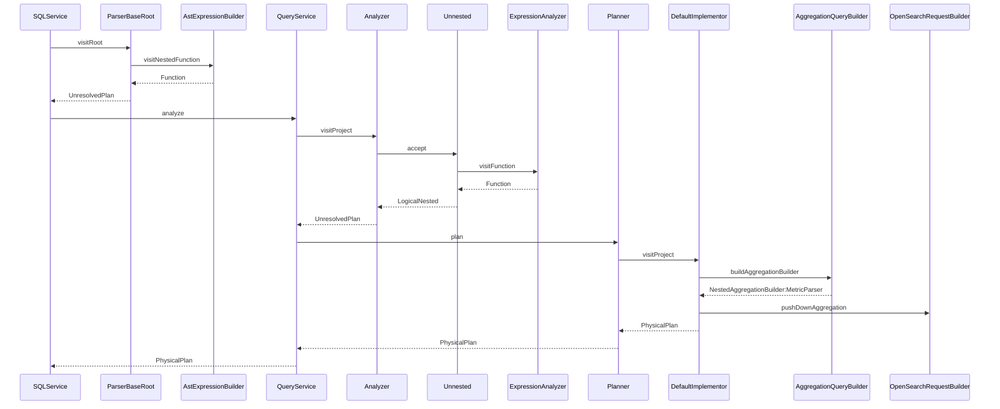

# Overview

The OpenSearch SQL plugin provides a thin-client language-processing engine from SQL to an OpenSeach instance.  The SQL
language is a relational language that provides the JOIN feature to relate tables together by field or expression.  OpenSearch
offers a similar relation mapping within an index, that allows users to relate same-index documents using a parent-child
relation.

This proposal is to outline the limits of a same-table (ie same-index) join relation from SQL grammar, and provide use
cases for same-table JOINs. 

# Table of Contents

`TODO`

# Same-Table Joins Query Design

`TODO`: Overview of problem and what JOIN relations are aiming to solve

## 1. Motivation

`TODO`: Use cases, and SQL statements

## 2. References

* [[FEATURE] Support for subqueries or chaining of queries](https://github.com/opensearch-project/sql/issues/1441)
* [opensearch.org: Join field type](https://opensearch.org/docs/latest/field-types/join/)

## 3. Assumptions/Dependencies

* _shard must be defined for any query using a same-table join
* 

### 3.1 Out of Scope

* Performance on the OpenSearch side
* Multiple-shard queries using `join`
* `join` using lateral-table support [PartiQL support in OpenSearch SQL V2](https://github.com/opensearch-project/sql/issues/1104)
* Pagination using `join` or other complex types

### 3.2 Design Decisions

* JOIN-relations architecture is built to work in combination with the `nested` and `object` data types.  This allows enables
both same-table joins and nested object (using PartiQL) to share execution paths and syntax.  This also enables a shared
solution to expand support for `lateral` tables and enable `lateral join` and `lateral nested` queries. 
  * see [Add support for PArtiQL in V2 engine](https://github.com/opensearch-project/sql/issues/1104)

### 3.3. Storage Type

`reference to opensearch doc`
`Describe how to define the JOIN-relation`
`What the datatype can do`
`What the datatype cannot do`

## 4. Use Cases

Use Cases have examples that is defined in the Annex. 

### 4.1 Case SELECT... FROM... JOIN on parent relation

Summary: 

Example query (SQL): 
```sql
SELECT *
FROM got AS m
JOIN got as h ON (m.house_relation.member = h.house_relation.house)
WHERE h.house.name = "Targaryen"
```

Expected Request to OpenSearch:
```json
{
    "query": {
        "bool": {
            "must": [
                {
                    "has_parent": {
                        "parent_type": "house",
                        "query": {
                            "match": {
                                "house.name": "Targaryen"
                            }
                        }
                    }
                },
                {
                    "term": {
                        "house_relation": "member"
                    }
                }
            ]
        }
    },
    "_source": {
        "includes": [],
        "excludes": []
    }
}
```

Expected Response (OpenSearch-JSON): 
```json
{
    "took": 5,
    "timed_out": false,
    "_shards": {
        "total": 1,
        "successful": 1,
        "skipped": 0,
        "failed": 0
    },
    "hits": {
        "total": {
            "value": 1,
            "relation": "eq"
        },
        "max_score": 1.0,
        "hits": [
            {
                "_index": "got-joins",
                "_id": "4",
                "_score": 1.0,
                "_routing": "1",
                "_source": {
                    "house_relation": {
                        "name": "member",
                        "parent": "1"
                    },
                    "name": {
                        "firstname": "Daenerys",
                        "lastname": "Targaryen"
                    },
                    "nickname": "Daenerys \"Stormborn\"",
                    "gender": "F",
                    "parents": {
                        "father": "Aerys",
                        "mother": "Rhaella"
                    },
                    "titles": [
                        {
                            "title": "Mother Of Dragons"
                        },
                        {
                            "title": "Queen Of The Andals"
                        },
                        {
                            "title": "Breaker Of Chains"
                        },
                        {
                            "title": "Khaleesi"
                        }
                    ]
                }
            }
        ]
    }
}
```

### 4.2 Case SELECT... FROM... JOIN... WHERE on parent relation

Summary:

Example query (SQL):
```sql
SELECT m.name, h.house.name, h.house.words
FROM got AS m
       JOIN got as h ON (m.house_relation.member = h.house_relation.house)
WHERE h.house.name = "Stark"

```

Expected Request to OpenSearch:
```json
{
  "query": {
    "bool": {
      "must": [
        {
          "has_parent": {
            "parent_type": "house",
            "query": {
              "match": {
                "house.name": "Stark"
              }
            },
            "inner_hits": {
              "_source": {
                "includes": [
                  "house.name",
                  "house.words"
                ],
                "excludes": []
              }
            }
          }
        },
        {
          "term": {
            "house_relation": "member"
          }
        }
      ]
    }
  },

  "_source": {
    "includes": [
      "name",
      "house_relation"
    ],
    "excludes": []
  }
}
```

Expected Response (OpenSearch-JSON):
```json
{
  "took": 5,
  "timed_out": false,
  "_shards": {
    "total": 1,
    "successful": 1,
    "skipped": 0,
    "failed": 0
  },
  "hits": {
    "total": {
      "value": 2,
      "relation": "eq"
    },
    "max_score": 2.2685113,
    "hits": [
      {
        "_index": "got-joins",
        "_id": "5",
        "_score": 2.2685113,
        "_routing": "1",
        "_source": {
          "house_relation": {
            "parent": "2",
            "name": "member"
          },
          "name": {
            "firstname": "Eddard",
            "lastname": "Stark"
          }
        },
        "inner_hits": {
          "house": {
            "hits": {
              "total": {
                "value": 1,
                "relation": "eq"
              },
              "max_score": 1.540445,
              "hits": [
                {
                  "_index": "got-joins",
                  "_id": "2",
                  "_score": 1.540445,
                  "_routing": "1",
                  "_source": {
                    "house": {
                      "name": "Stark",
                      "words": "Winter Is Coming"
                    }
                  }
                }
              ]
            }
          }
        }
      },
      {
        "_index": "got-joins",
        "_id": "6",
        "_score": 2.2685113,
        "_routing": "1",
        "_source": {
          "house_relation": {
            "parent": "2",
            "name": "member"
          },
          "name": {
            "firstname": "Brandon",
            "lastname": "Stark"
          }
        },
        "inner_hits": {
          "house": {
            "hits": {
              "total": {
                "value": 1,
                "relation": "eq"
              },
              "max_score": 1.540445,
              "hits": [
                {
                  "_index": "got-joins",
                  "_id": "2",
                  "_score": 1.540445,
                  "_routing": "1",
                  "_source": {
                    "house": {
                      "name": "Stark",
                      "words": "Winter Is Coming"
                    }
                  }
                }
              ]
            }
          }
        }
      }
    ]
  }
}
```

### 4.3 Case SELECT... FROM... JOIN... WHERE on child relation

Summary:

Example query (SQL):
```sql
SELECT m.name, h.housename, h.words
FROM got AS h
JOIN got as m ON (m.house_relation.member = h.house_relation.house)
WHERE nested(m.titles, m.titles.title = "Kingslayer"))

```

Expected Request to OpenSearch:
```json
{
    "query": {
        "bool": {
            "must": [
                {
                    "has_child": {
                        "type": "member",
                        "query": {
                            "nested": {
                                "path": "titles",
                                "query": {
                                    "bool": {
                                        "must": {
                                            "match": {
                                                "titles.title": "Kingslayer"
                                            }
                                        }
                                    }
                                }
                            }
                        },
                        "inner_hits": {
                            "_source": {
                                "includes": [
                                    "name"
                                ],
                                "excludes": []
                            }
                        }
                    }
                },
                {
                    "term": {
                        "house_relation": "house"
                    }
                }
            ]
        }
    },
    "_source": {
        "includes": [
            "house"
        ],
        "excludes": []
    }
}
```

Expected Response (OpenSearch-JSON):
```json
{
    "took": 5,
    "timed_out": false,
    "_shards": {
        "total": 1,
        "successful": 1,
        "skipped": 0,
        "failed": 0
    },
    "hits": {
        "total": {
            "value": 1,
            "relation": "eq"
        },
        "max_score": 1.0,
        "hits": [
            {
                "_index": "got-joins",
                "_id": "3",
                "_score": 1.0,
                "_routing": "1",
                "_source": {
                    "house": {
                        "seat": "Casterly Rock",
                        "sigil": "Lion",
                        "name": "Lannister",
                        "words": "Hear Me Roar"
                    }
                },
                "inner_hits": {
                    "member": {
                        "hits": {
                            "total": {
                                "value": 1,
                                "relation": "eq"
                            },
                            "max_score": 2.4849067,
                            "hits": [
                                {
                                    "_index": "got-joins",
                                    "_id": "7",
                                    "_score": 2.4849067,
                                    "_routing": "1",
                                    "_source": {
                                        "name": {
                                            "firstname": "Jaime",
                                            "lastname": "Lannister"
                                        }
                                    }
                                }
                            ]
                        }
                    }
                }
            }
        ]
    }
}
```

### 4.4 Case SELECT... FROM... JOIN ON (parent _id)

Summary:

Example query (SQL):
```sql
SELECT vh.house, vh.house_relation.name
FROM got AS vh
JOIN got as h ON (h._id = "3")
```

Expected Request to OpenSearch:
```json
{
    "query": {
        "parent_id": {
            "type": "vassel_house",
            "id": "3"
        }
    },
    "_source": {
        "includes": [
            "house",
            "house_relation.name"
        ],
        "excludes": []
    }
}
```

Expected Response (OpenSearch-JSON):
```json
{
    "took": 3,
    "timed_out": false,
    "_shards": {
        "total": 1,
        "successful": 1,
        "skipped": 0,
        "failed": 0
    },
    "hits": {
        "total": {
            "value": 1,
            "relation": "eq"
        },
        "max_score": 1.3121864,
        "hits": [
            {
                "_index": "got-joins",
                "_id": "12",
                "_score": 1.3121864,
                "_routing": "1",
                "_source": {
                    "house_relation": {
                        "name": "vassel_house"
                    },
                    "house": {
                        "seat": "Crakehall",
                        "sigil": "Brindled Boar",
                        "name": "Crakehall",
                        "words": "None So Fierce"
                    }
                }
            }
        ]
    }
}
```


### 4.5 Case JOIN on multiple children

Summary:

Note, the Mapping file contains:
```json
{
  "mappings": {
    "properties": {
      "house_relation": {
        "type": "join",
        "relations": {
          "house": [
            "member",
            "retainer",
            "vassel_house"
          ],
          "vassel_house": "vassel"
        }
      }
    }
  }
}
```

Example query (SQL):
```sql
SELECT m_or_r_or_vh.name, m_or_r_or_vh.house
FROM got AS m_or_r_or_vh
JOIN got as h ON (m_or_r_or_vh.house_relation.member = h.house_relation.house
               OR m_or_r_or_vh.house_relation.retainer = h.house_relation.house
               OR m_or_r_or_vh.house_relation.vassel_house = h.house_relation.house
  )
WHERE h.house.name = "Targaryen"
```

Expected Request to OpenSearch:
```json
{
  "query": {
    "bool": {
      "must": [
        {
          "has_parent": {
            "parent_type": "house",
            "query": {
              "match": {
                "house.name": "Stark"
              }
            }
          }
        }
      ],
      "should": [
        {
          "term": {
            "house_relation": "member"
          }
        },
        {
          "term": {
            "house_relation": "retainer"
          }
        },
        {
          "term": {
            "house_relation": "vassel_house"
          }
        }
      ],
      "minimum_should_match" : 1
    }
  },

  "_source": {
    "includes": [
      "name",
      "house"
    ],
    "excludes": []
  }
}
```

### 4.6 Case JOIN ON Children and Grandchildren

Summary:

Example query (SQL):
```sql
SELECT v.name, h.house.name, h.house.words
FROM got AS v
JOIN got as vh ON (v.house_relation.vassel = vh.house_relation.vassel_house)
JOIN got as h ON (vh.house_relation.vassel_house = h.house_relation.house)
WHERE h.house.name = "Start"
```

Expected Request to OpenSearch:
```json
{
    "query": {
        "bool": {
            "must": [
                {
                    "has_parent": {
                        "parent_type": "vassel_house",
                        "query": {
                            "bool": {
                                "must": [
                                    {
                                        "has_parent": {
                                            "parent_type": "house",
                                            "query": {
                                                "match": {
                                                    "house.name": "Stark"
                                                }
                                            }
                                        }
                                    },
                                    {
                                        "term": {
                                            "house_relation": "vassel_house"
                                        }
                                    }
                                ]
                            }
                        }
                    }
                },
                {
                    "term": {
                        "house_relation": "vassel"
                    }
                }
            ]
        }
    },
    
    "_source": {
        "includes": [
            "name"
        ],
        "excludes": []
    }
}
```

Expected Response (OpenSearch-JSON):
```json
{
    "took": 5,
    "timed_out": false,
    "_shards": {
        "total": 1,
        "successful": 1,
        "skipped": 0,
        "failed": 0
    },
    "hits": {
        "total": {
            "value": 2,
            "relation": "eq"
        },
        "max_score": 2.5198257,
        "hits": [
            {
                "_index": "got-joins",
                "_id": "14",
                "_score": 2.5198257,
                "_routing": "1",
                "_source": {
                    "name": {
                        "firstname": "Roose",
                        "lastname": "Bolton"
                    }
                }
            },
            {
                "_index": "got-joins",
                "_id": "15",
                "_score": 2.5198257,
                "_routing": "1",
                "_source": {
                    "name": {
                        "firstname": "Ramsey",
                        "lastname": "Bolton"
                    }
                }
            }
        ]
    }
}
```


### 4.X *Case X*

Summary:

Example query (SQL):
```sql

```

Expected Request to OpenSearch:
```json

```

Expected Response (OpenSearch-JSON):
```json

```


## 5. Functional Requirements


| Feature                                | Priority     | Phase |
|----------------------------------------|--------------|-------|
| Update datatype to accept joins type   | must have    | P0    |
| Check for semantic errors on mapping   | must have    | P0    |
| Including routing_id API option        | must have    | P0    |
| Add parser support for JOIN...USING... | must have    | P0    |
| Allow for parent-child joins           | must have    | P0    |
| Allow for child-parent joins           | must have    | P0    |
| Retrieve inner_hits                    | should have  | P0/P1 |
| Allow for parent_id joins              | nice to have | P1    |
| Aggregation on children                | nice to have | P1    |
| Sorting on children                    | nice to have | P1    |
| Documentation for same-table Joins     | must have    | P0    |

### 5.1 Release Schedule

| Release                                                                     | Dependency   | Effort |
|-----------------------------------------------------------------------------|--------------|--------|
| Phase 0 - containing basic support for parent-child mapping<br/>Allows for  | must have    | P0     |
| Check for semantic errors on mapping                                        | must have    | P0     |
| Including routing_id API option                                             | must have    | P0     |
| Add parser support for JOIN...USING...                                      | must have    | P0     |
| Allow for parent-child joins                                                | must have    | P0     |
| Allow for child-parent joins                                                | must have    | P0     |
| Retrieve inner_hits                                                         | should have  | P0/P1  |
| Allow for parent_id joins                                                   | nice to have | P1     |
| Aggregation on children                                                     | nice to have | P1     |
| Sorting on children                                                         | nice to have | P1     |
| Documentation for same-table Joins                                          | must have    | P0     |

## 6. High-Level Design

### 6.1 Parser Syntax

```antlrv4

```

### 6.1 Presentation

The following diagram explains the proposed sequence to create JOIN request to OpenSearch

`DEBUG`: reference for [mermaid.js](http://mermaid-js.github.io/mermaid/#/)



### 6.1 Presentation

### 6.2 Elements

### 6.3 Entity-Relation


### 6.4 Entities

## 7. Detailed-Design Architecture

### 7.1 Presentation

### 7.2 Elements

# Annex

## Annex A - Data Mapping for examples

The following section includes data-mapping for data in Annex B that can be PUT into OpenSearch as an index mapping. 

```json
{
  "mappings": {
    "properties": {
      "house_relation": {
        "type": "join",
        "relations": {
          "house": ["member", "retainer", "vassel_house"],
          "vassel_house": "vassel"
        }
      },
      "nickname": {
        "type": "keyword"
      },
      "name": {
        "properties": {
          "firstname": {
            "type": "text",
            "fielddata": true
          },
          "lastname": {
            "type": "text",
            "fielddata": true
          }
        }
      },
      "gender": {
        "type": "text",
        "fields": {
          "keyword": {
            "type": "keyword"
          }
        }
      },
      "parents": {
        "properties": {
          "father": {
            "type": "keyword"
          },
          "mother": {
            "type": "keyword"
          }
        }
      },
      "titles": {
        "type": "nested",
        "properties": {
          "title": {
            "type": "keyword"
          }
        }
      },
      "words": {
        "type": "text",
        "fielddata": true
      },
      "house": {
        "properties": {
          "name": {
            "type": "keyword"
          },
          "sigil": {
            "type": "keyword"
          },
          "seat": {
            "type": "keyword"
          }
        }
      }
    }
  }
}
```

## Annex B - Data for examples

The following section includes data that has been formatted to be used by the OpenSearch `got/_bulk` ingest endpoint.  

Houses:
```json
{"index":{"_id":"1"}}
{"house_relation": {"name":"house"},"house":{"name":"Targaryen","words":"Fire And Blood","sigil":"Dragon","seat":"Dragonstone"}}
{"index":{"_id":"2"}}
{"house_relation": {"name":"house"},"house":{"name":"Stark","words":"Winter Is Coming","sigil":"Direwolf","seat":"Winterfell"}}
{"index":{"_id":"3"}}
{"house_relation": {"name":"house"},"house":{"name":"Lannister","words":"Hear Me Roar","sigil":"Lion","seat":"Casterly Rock"}}

```

Members: 
```json
{"index":{"_id":"4"}}
{"house_relation":{"name":"member","parent":"1"},"name":{"firstname":"Daenerys","lastname":"Targaryen"},"nickname":"Daenerys \"Stormborn\"","gender":"F","parents":{"father":"Aerys","mother":"Rhaella"},"titles":[{"title":"Mother Of Dragons"},{"title":"Queen Of The Andals"},{"title":"Breaker Of Chains"},{"title":"Khaleesi"}]}
{"index":{"_id":"5"}}
{"house_relation":{"name":"member","parent":"2"},"name":{"firstname":"Eddard","lastname":"Stark"},"parents":{"father":"Rickard" , "mother":"Lyarra"} ,"gender":"M","titles":[{"title":"Lord Of Winterfell"},{"title":"Warden Of The North"},{"title":"Hand Of The King"}]}
{"index":{"_id":"6"}}
{"house_relation":{"name":"member","parent":"2"},"name":{"firstname":"Brandon","lastname":"Stark"},"parents":{"father":"Eddard","mother":"Catelyn"},"gender":"M","titles":{"title":"Prince Of Winterfell"}}
{"index":{"_id":"7"}}
{"house_relation":{"name":"member","parent":"3"},"name":{"firstname":"Jaime","lastname":"Lannister"},"gender":"M","parents":{"father":"Tywin","mother":"Joanna"},"titles":[{"title":"Kingslayer"},{"title":"Lord Commander Of The Kingsguard"},{"title":"Ser"}]}

```

Vassel Houses:
```json
{"index":{"_id":"10"}}
{"house_relation": {"name":"vassel_house","parent":"2"},"house":{"name":"Bolton","words":"Our Blades Are Sharp","sigil":"Flayed Man","seat":"Dreadfort"}}
{"index":{"_id":"11"}}
{"house_relation": {"name":"vassel_house","parent":"2"},"house":{"name":"Mormont","words":"Here We Stand","sigil":"Black Bear","seat":"Bear Island"}}
{"index":{"_id":"12"}}
{"house_relation": {"name":"vassel_house","parent":"3"},"house":{"name":"Crakehall","words":"None So Fierce","sigil":"Brindled Boar","seat":"Crakehall"}}

```

Vassels:
```json
{"index":{"_id":"13"}}
{"house_relation":{"name":"vassel","parent":"12"},"name":{"firstname":"Desmond","lastname":"Crakehall"},"gender":"M","titles":{"title":"Lord of Crakehall"}}
{"index":{"_id":"14"}}
{"house_relation":{"name":"vassel","parent":"10"},"name":{"firstname":"Roose","lastname":"Bolton"},"gender":"M","titles":{"title":"Lord of the Dreadfort"}}
{"index":{"_id":"15"}}
{"house_relation":{"name":"vassel","parent":"10"},"name":{"firstname":"Ramsey","lastname":"Bolton"},"gender":"M"}

```

Retainers:
```json
{"index":{"_id":"8"}}
{"house_relation":{"name":"retainer","parent":"2"},"name":{"firstname":"Luwin"},"nickname":"Maester Luwin","gender":"M","titles":{"title":"Maester"}}
{"index":{"_id":"9"}}
{"house_relation":{"name":"retainer","parent":"2"},"name":{"firstname":"Rodrik","lastname":"Cassel"},"nickname":"Maester Luwin","gender":"M","titles":[{"title":"Ser"},{"title":"Master-At-Arms at Winterfell"},{"title":"Castellan of Winterfell"}]}

```