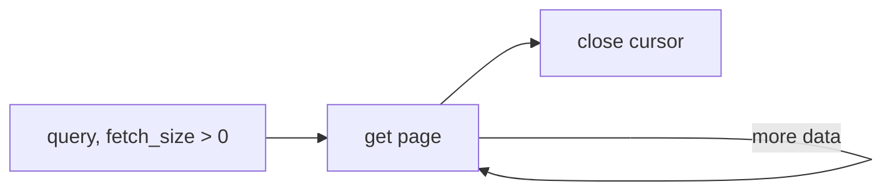
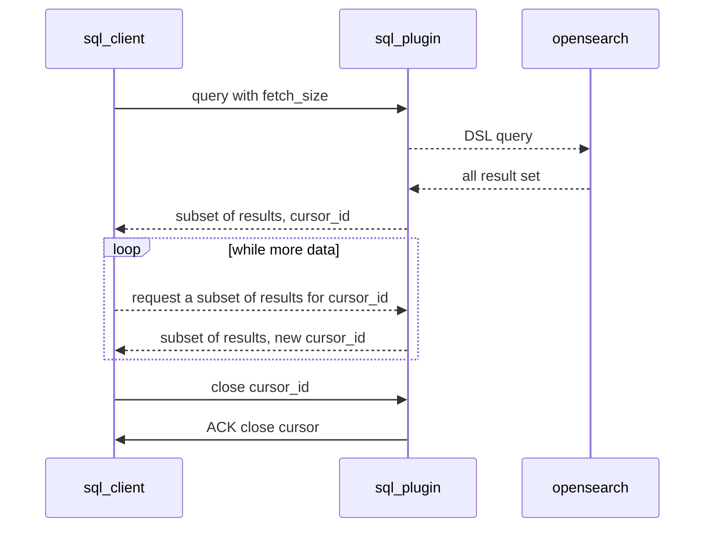
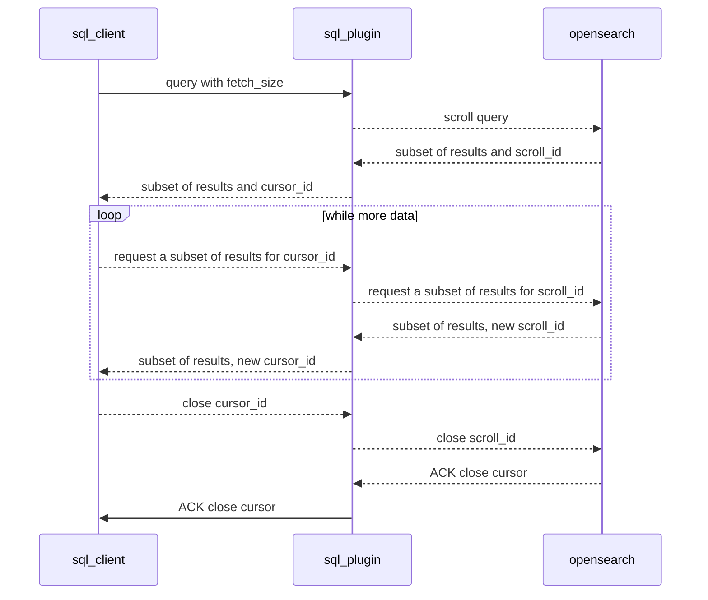

# Pagination in v2 Engine

<!-- Why is pagination necessary? -->
Pagination allows a SQL plugin client to retrieve arbitrarily large
results sets one subset at a time.

A cursor is a SQL abstraction for pagination. A client can open a cursor, retrieve a subset of data given a cursor and close a cursor.
<!-- What applications will use pagination? -->

Currently, SQL plugin does not provide SQL cursor syntax. However, the SQL REST endpoint can return result a page at a time. This feature is used by JDBC and ODBC drivers.

<!-- How will applications use pagination? -->

# Scope
<!-- What scenarios are excluded from this discussion? Why? -->

The primary goal is to reach feature parity with the v1 engine. v1 engine supports pagination only for simple `SELECT` queries with optional `WHERE` or `ORDER BY` clauses.

## Compatibility with v1 engine
<!-- How can one tell that v2 engine pagination is compatible with v1? -->

The REST API will remain the same. However, v1 cursors are a thin wrapper over OpenSearch's scroll API.

This is not possible with v2 engine because it may perform some queries in-memory.

As a result, the cursor format will change and some 
# Behaviour Specification
## Default Scenario

A client requests a paginated response, retrieves data a subset at a time, and closes the cursor.


Each subset response also includes a possibly new value for `cursor_id`. Client must ensure
to pass the correct cursor id with each page request.


### Client submits request with non-existing cursor_id 

A client will receive an error response if it sends a request with a cursor_id that SQL plugin does not maintain.

This can happen when client requests a paginated response but the cursor times out before all the data is retrieved.

Response will include `error` and `status` fields.

## Unable to create a new cursor [new]
SQL plugin will have a limit on number of open cursors.

A client will receive an error response when it requests a paginated response and the plugin reached the limit of possible open cursors.

# Implementation

## REST API
Initial query
```
POST /_plugins/_sql
{
    "query" : "...",
    "fetch_size": N
}
```

Response
```
{
  "cursor": /* cursor_id */,
  "datarows": [
    // ...
    ],
  "schema" : [
    // ...
  ]
}
```

Get page
```
POST /_plugins/_sql
{
  "cursor": "<cursor_id>"
}
```
response is same as initial response.

Close cursor
```
POST /_plugins/_sql/close
{
    "cursor" : "<cursor_id>"
}
```

Response
```json
{
    "succeeded": true
}

```
v1 engine always returns sucess on close even if the cursor is no longer alive as long as it recognizes cursor_id as a valid cursor identifier.

v1 engine responds with an error such this if cursor_id is not a valid cursor identifier.
```json5
{
    "error": {
        // ...
    },
    "status": 400
}
```
## Communication with OpenSearch

There are several options to communicate with OpenSearch.

Depending on the type of query, it 
### Non-scroll request

For some queries, SQL plugin can fetch all data from OpenSearch at once.



### Scroll-backed request




### Search after request
Scroll requests are resource intensive and are not recommended for some sets of queries.

Search after is a simpler API that may be appliacble in some scenarios.

For example, if a query uses `ORDER BY` clause we may get the data using search after instead of a scroll request.

# Open Questions

1. Should SQL Plugin limit number of concurrent cursors?
1. Can SQL Plugin switch between simple search and scroll api search based on physical plan of a query?
