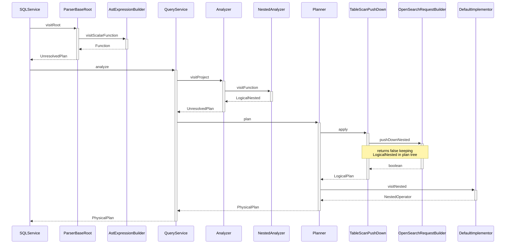

## Description

The `nested` function when used in the `WHERE` clause of an SQL statement filters documents of `nested` object type based on field properties. After a `SELECT` clause is pushed down to OpenSearch the response objects are flattened as illustrated in [Section 2.3](#24-select-clause-nested-query-class-diagram). If multiple `nested` function calls are used in a `SELECT` clause on multiple nested fields with differing paths, a cross-join is returned of the rows in both nested fields.

## Table of Contents
1. [Overview](#1-overview)
2. [Syntax](#11-syntax)
3. [Changes To Core](#12-changes-to-core)
4. [Example Queries](#13-example-queries)
5. [Architecture Diagrams](#2-architecture-diagrams)
8. [Sequence Diagram for Nested Select Clause Post-processing](#23-sequence-diagram-for-nested-select-clause-post-processing)
10. [Additional Info](#additional-info)
12. [Release Schedule](#release-schedule)

## 1 Overview
### 1.1 Syntax

The nested function has two syntax options when used in the `WHERE` clause of an SQL statement. ...
- `nested(field | field, path)`

### 1.2 Changes To Core
- **NestedOperator:** Responsible for post-processing and flattening of OpenSearch response.
- **LogicalNested:** Stores data required for OpenSearch DSL push down.
- **NestedAnalyzer:** Identifies nested functions used in `SELECT` clause for `LogicalNested` creation.
- **Analyzer:** Added ownership of NestedAnalyzer.


### 1.3 Example Queries

Most basic example from mapping to response from SQL plugin.

**Mapping:**
```json
{
  "mappings": {
    "properties": {
      "message": {
        "type": "nested",
        "properties": {
          "info": {
            "type": "keyword",
            "index": "true"
          }
        }
      }
    }
  }
}
```

**Dataset:**
```json
{"index":{"_id":"1"}}
{"message":{"info":"a"}}
```

**Query:**
`SELECT nested(message.info) FROM nested_objects;`

**Response:**
```json
{
    "schema": [
        {
            "name": "nested(message.info)",
            "type": "keyword"
        }
    ],
    "datarows": [
        [
            "a"
        ]
    ],
    "total": 1,
    "size": 1,
    "status": 200
}
```

A basic nested function in the SELECT clause and output DSL pushed to OpenSearch. This example queries the `nested` object `message` and the inner field `info` to return all matching inner fields values.
- `SELECT nested(message.info, message) FROM nested_objects;`
```json

```

- `SELECT nested(message.info, message), nested(message.author, message) FROM nested_objects;`
```json

```


- `SELECT nested(message.info, message), nested(comment.data, comment) FROM nested_objects;`
```json

```

## 2 Architecture Diagrams
### 2.1 Composite States for Nested Query Execution

Nested function state diagram illustrating states in SQL plugin for push down execution. The nested operator stays in the `Physical Plan Tree` after push down for flattening operation in post-processing. See section [2.3](#24-select-clause-nested-query-class-diagram) for flattening sequence and description.

### 2.2 Sequence Diagram for Nested SELECT Clause Query Push Down
Nested function sequence diagram illustrating query execution from parsing to OpenSearch DSL push down.




## Additional Info

### Demo Video

### Release Schedule
See Issues Tracked under [Issue 1111](https://github.com/opensearch-project/sql/issues/1111) for related PR's and information.
