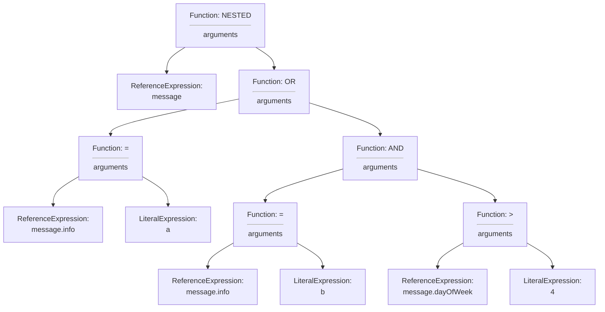
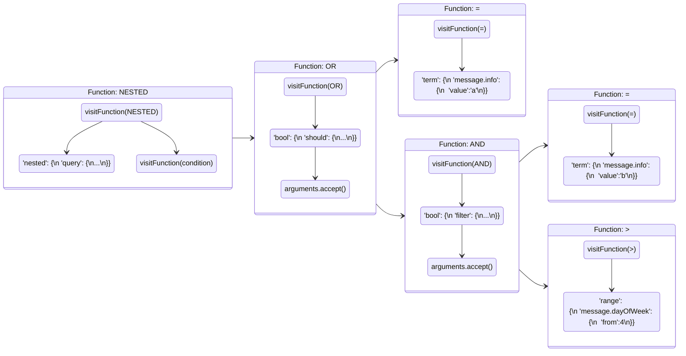
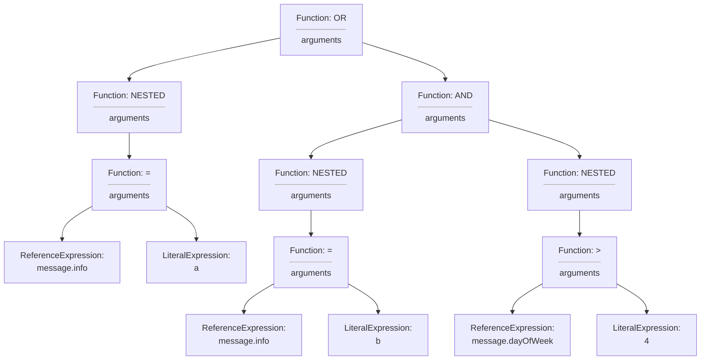
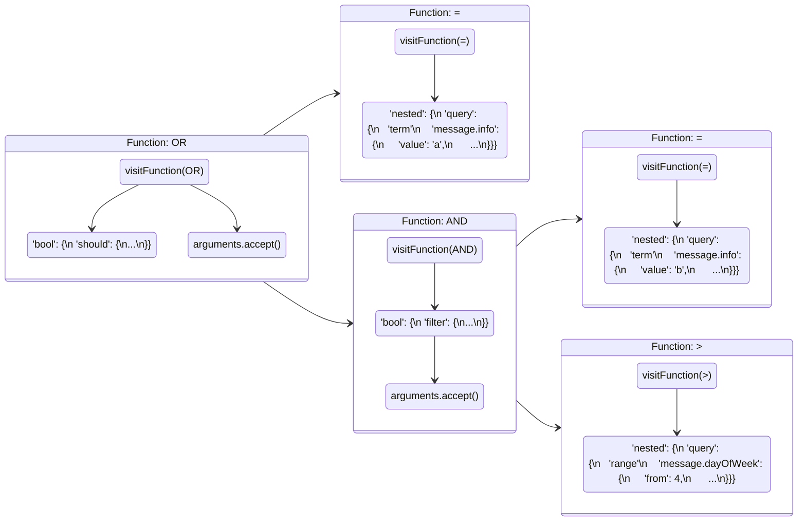

## Description

The `nested` function when used in the `WHERE` clause of an SQL statement filters documents of `nested` object type based on field properties. Two syntax options are available to users see section [1.1 Syntax](#11-syntax), both syntax options achieve the goal of filtering with a `nested` field, an `Operator` and a `Literal` value. Both syntax options produce different DSL to push to OpenSearch based on the `AND/OR/NOT` boolean queries residing inside a `nested` query or vice versa. See section [4?]() for examples depicting this alternate DSL creation. Testing large groups of push down execution times for identical queries using the different syntax options showed a nominal difference of approximately 3% for Syntax option 2.

## Table of Contents
1. [Overview](#1-overview)
2. [Syntax](#11-syntax)
3. [Changes To Core](#12-changes-to-core)
4. [Example Queries](#13-example-queries)
5. [Architecture Diagrams](#2-architecture-diagrams)
8. [Sequence Diagram for Nested Select Clause Post-processing](#23-sequence-diagram-for-nested-select-clause-post-processing)
10. [Additional Info](#additional-info)
12. [Release Schedule](#release-schedule)

## 1 Overview
### 1.1 Syntax

The nested function has two syntax options when used in the `WHERE` clause of an SQL statement. Both syntax options a
- `nested(field | field, path) OPERATOR LITERAL`
- `nested(path, condition)`

### 1.2 Changes To Core
- **FilterQueryBuilder:** Added logic to handle `nested` functions in `WHERE` clause as predicate expression and `FunctionExpression`.
- **LuceneQuery:** Added logic to handle `nested` functions and `FunctionExpression`'s on both sides of `OPERATOR` in `WHERE` clause.


### 1.3 Example Queries

Most basic example from mapping to response from SQL plugin.

**Mapping:**
```json
{
  "mappings": {
    "properties": {
      "message": {
        "type": "nested",
        "properties": {
          "info": {
            "type": "keyword",
            "index": "true"
          }
        }
      }
    }
  }
}
```

**Dataset:**
```json
{"index":{"_id":"1"}}
{"message":{"info":"a"}}
{"index":{"_id":"2"}}
{"message":{"info":"c"}}
```

**Query:**
- `SELECT * FROM nested_objects WHERE nested(message.info) = 'a';`
- `SELECT * FROM nested_objects WHERE nested(message, message.info = 'a');`

Both queries produce same result.
**Response:**
```json
{
  "schema": [
    {
      "name": "message",
      "type": "nested"
    }
  ],
  "datarows": [
    [
      [
        {
          "info": "a"
        }
      ]
    ]
  ],
  "total": 1,
  "size": 1,
  "status": 200
}
```

A basic nested function in the SELECT clause and output DSL pushed to OpenSearch. This example filters the `nested` object `message` and the inner field `info` with the value of 'a'.
- `SELECT * FROM nested_objects WHERE nested(message.info) = 'a' OR nested(message.author) = 'elm';`
```json

```

... explain
- `SELECT * FROM nested_objects WHERE nested(message, message.info = 'a' OR messate.author = 'elm');`
```json

```

... explain note is flattened
- `SELECT nested(message.info) FROM nested_objects WHERE nested(message.info) = 'a';`
```json

```

... explain note differing path values
- `SELECT * FROM nested_objects WHERE nested(message, message.info = 'a') OR nested(comment, comment.data = '123');`
```json

```

## 2 Architecture Diagrams
### 2.1 Composite States for Nested Query Execution

Nested function state diagram illustrating states in SQL plugin for push down execution. The nested operator stays in the `Physical Plan Tree` after push down for flattening operation in post-processing. See section [2.3](#24-select-clause-nested-query-class-diagram) for flattening sequence and description.

### 2.2 Sequence Diagram for Nested SELECT Clause Query Push Down
Nested function sequence diagram illustrating query execution from parsing to OpenSearch DSL push down.

```mermaid
sequenceDiagram
    participant TableScanPushDown
    participant OpenSearchIndexScanQueryBuilder
    participant FilterQueryBuilder

sequenceDiagram

%% Flattening
TableScanPushDown->>+OpenSearchIndexScanQueryBuilder:pushDownFilter
  OpenSearchIndexScanQueryBuilder->>+FilterQueryBuilder:build
      loop Iterate Expressions
        FilterQueryBuilder->>FilterQueryBuilder:visitFunction
      end
  FilterQueryBuilder-->>-OpenSearchIndexScanQueryBuilder:QueryBuilder
OpenSearchIndexScanQueryBuilder-->>-TableScanPushDown:LogicalPlan
```

### 2.? Syntax option 1 object tree


### 2.? Syntax option 1 Filter push down sequence


Output DSL:
```json
{
  "nested" : {
    "query" : {
      "bool" : {
        "should" : [
          {
            "term" : {
              "message.info" : {
                "value" : "a",
                "boost" : 1.0
              }
            }
          },
          {
            "bool" : {
              "filter" : [
                {
                  "term" : {
                    "message.info" : {
                      "value" : "b",
                      "boost" : 1.0
                    }
                  }
                },
                {
                  "range" : {
                    "message.dayOfWeek" : {
                      "from" : 4,
                      ...
                    }
                  }
                }
              ]
            }
          }
        ]
      }
    }
  }
}
```

### 2.? Syntax option 2





```json
{
  "bool" : {
    "should" : [
      {
        "nested" : {
          "query" : {
            "term" : {
              "message.info" : {
                "value" : "a",
                "boost" : 1.0
              }
            }
          },
          ...
        }
      },
      {
        "bool" : {
          "filter" : [
            {
              "nested" : {
                "query" : {
                  "term" : {
                    "message.info" : {
                      "value" : "b",
                      "boost" : 1.0
                    }
                  }
                },
                ...
              }
            },
            {
              "nested" : {
                "query" : {
                  "range" : {
                    "message.dayOfWeek" : {
                      "from" : 4,
                      ...
                    }
                  }
                },
                ...
              }
            }
          ]
        }
      }
    ]
  }
}
```

## Additional Info

### Demo Video

### Release Schedule
See Issues Tracked under [Issue 1111](https://github.com/opensearch-project/sql/issues/1111) for related PR's and information.
